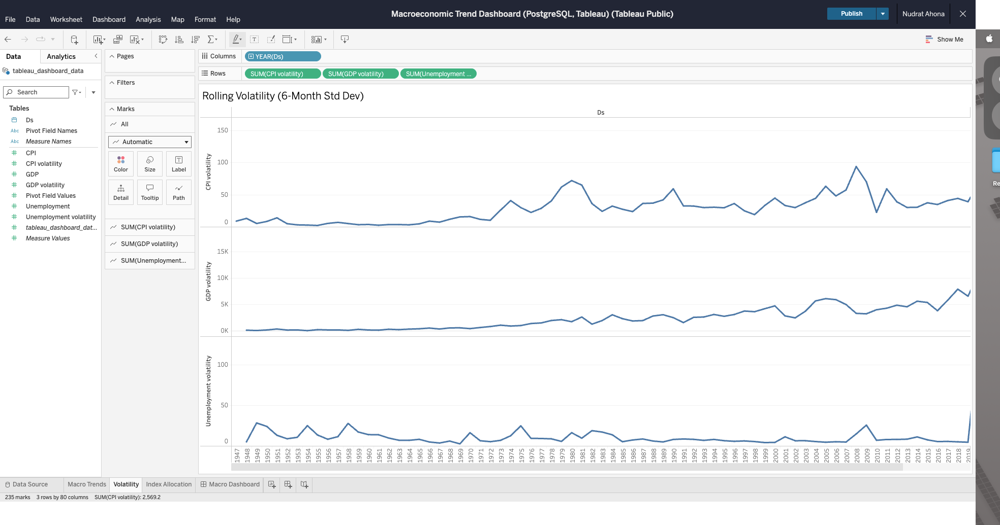
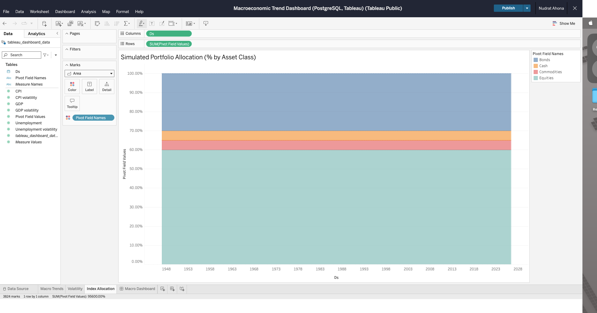

# Macroeconomic Trend Dashboard — Forecasting & Portfolio Simulation

**Author**: Nudrat Hanna Ahona  
**Date**: July 2025  
**Tools**: Python, PostgreSQL, Prophet, Tableau Public

---

##  Overview

This project simulates how macroeconomic conditions influence portfolio reallocation in financial environments. It uses real-world macro data (CPI, GDP, Unemployment) to forecast trends and simulate portfolio volatility like churn modeling.

---

## Tools & Technologies

- PostgreSQL: Data storage & retrieval
- Python: Forecasting & modeling
- Prophet: Time-series prediction
- Tableau Public: Dashboard visualization

---

## Project Structure

scripts/
│ ├── 01_fred_data_to_postgres.py
│ ├── 02_forecast_and_volatility_model.py
│ ├── 03_simulate_index_logic.py
│ └── 04_prepare_tableau_dataset.py

data/
│ ├── macro_forecast_volatility.csv
│ ├── index_simulation.csv
│ └── tableau_dashboard_data.csv

---

## Dashboard Previews

| Macro Trends | Volatility | Portfolio Allocation |
|--------------|------------|----------------------|
|  |  |  |

View Full Dashboard →(https://public.tableau.com/views/MacroeconomicTrendDashboardPostgreSQLTableau/MacroDashboard?:language=en-US&publish=yes&:sid=&:redirect=auth&:display_count=n&:origin=viz_share_link)

---

## Use Case

- Forecast macro risk and instability
- Simulate investment behavior during volatility
- Build dashboards for financial decision-making

---

